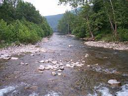
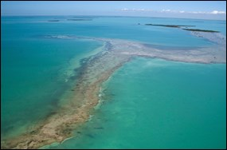
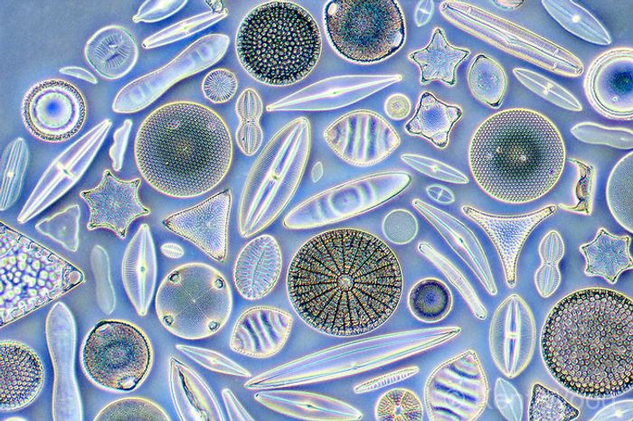
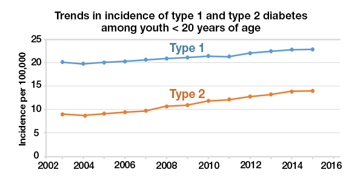
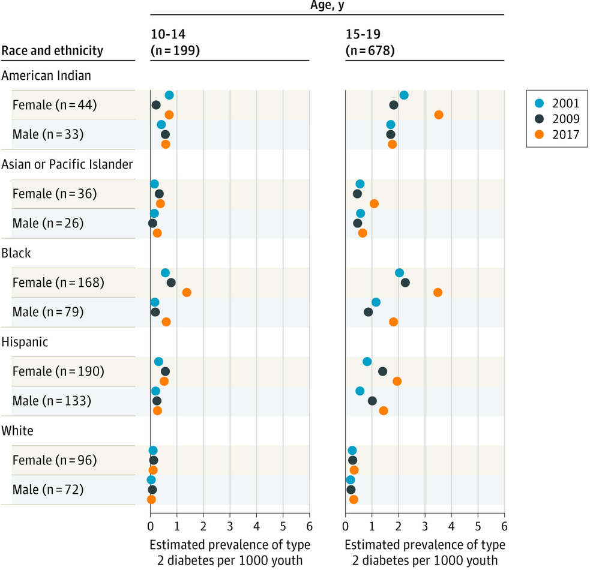
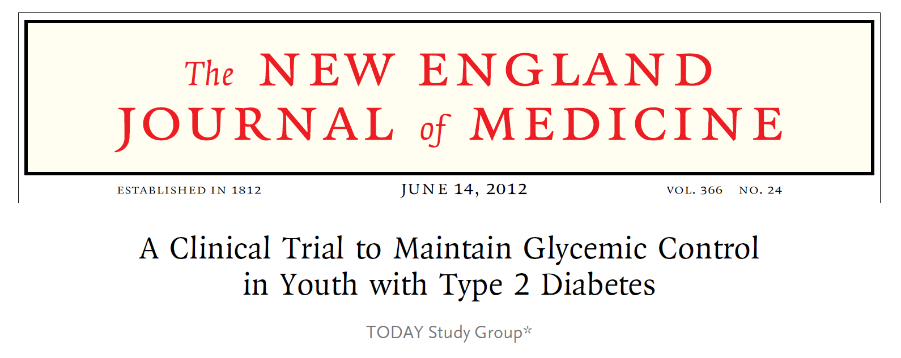

```{r setup, include=FALSE}
knitr::opts_chunk$set(echo = FALSE)
```

<style>
div.footnotes {
  position: absolute;
  bottom: 0;
  margin-bottom: 10px;
  width: 80%;
  font-size: 0.6em;
}
</style>

<script src="https://ajax.googleapis.com/ajax/libs/jquery/3.1.1/jquery.min.js"></script>
<script>
$(document).ready(function() {
  $('slide:not(.backdrop):not(.title-slide)').append('<div class=\"footnotes\">');

  $('footnote').each(function(index) {
    var text  = $(this).html();
    var fnNum = (index+1).toString();
    $(this).html(fnNum.sup());

    var footnote   = fnNum + '. ' + text + '<br/>';
    var oldContent = $(this).parents('slide').children('div.footnotes').html();
    var newContent = oldContent + footnote;
    $(this).parents('slide').children('div.footnotes').html(newContent);
  });
});
</script>

<script>
$(document).ready(function() {
  $('slide:not(.backdrop):not(.title-slide)').append('<div class=\"footnotes\">');

  $('footnote_nonum').each(function(index) {
    var text  = $(this).html();
    var fnNum = (index+1).toString();
    $(this).html(fnNum.sup());

    var footnote   = text + '<br/>';
    var oldContent = $(this).parents('slide').children('div.footnotes').html();
    var newContent = oldContent + footnote;
    $(this).parents('slide').children('div.footnotes').html(newContent);
  });
});
</script>


## Outline

- how I got into statistics, my career path
- some interesting projects I've worked on
- lessons learned???
- Q&A

## Undergraduate and graduate studies in biology

- BA Biology and MS in Evolutionary and Population Biology, George Mason University
- Worked with scientists at the Nature Conservancy to study patterns of plant communities and invasive species in the forests along the Potomac River

<p align="center">
{height=40%, width=40%}
<p>

## Graduate studies in environmental science

- PhD program in Environmental Science at Duke University
- My research used diatoms to reconstruct the ecological history of Florida Bay

<p align="center">
{height=48%, width=48%} {height=48%, width=48%}
<p>


## My path to biostatistics

- While at Duke, I took graduate courses in statistics at North Carolina State University
- I was feeling less certain that I wanted to specialize in one particular research question, and statistics appealed to me as a tool to answer diverse questions
- I left my graduate program early with an MA and took a couple of years off
- Moved to the DC area and took a job as a Research Associate at the George Washington University Biostatistics Center

<p align="center">
{height=65%, width=65%}
<p>

## Working at a "coordinating center"

- Coordinating centers are established for multi-center clinical trials
- They are responsible for advising on study design and the analytic plan, all aspects of data management, performing the statistical analysis, manuscript writing, and general oversight and communications
- Statisticians work as part of large teams along with programmers, content matter experts, administrators, etc.
- These are generally large projects with 1-2 years of planning prior to study start and 3-4 years of data collection
- Analysis usually begins when sufficient baseline data are collected

## The TODAY study

- The TODAY study was a clinical trial to compare 3 treatments for type 2 diabetes in children and adolescents
- Type 2 diabetes (T2D) used to be known as adult-onset diabetes and results from a combination of genetic and lifestyle factors (overweight, inactivity)
- The incidence of T2D among youth is increasing.<footnote>https://www.cdc.gov/diabetes/research/reports/children-diabetes-rates-rise.html</footnote>

<p align="center">
{height=70%, width=70%} 
<p>

## The TODAY study

<footnote_nonum>Lawrence et al. 2021, JAMA.</footnote_nonum>

<p align="center">
{height=60%, width=60%} 
<p>

## The TODAY study

<p align="center">
{height=48%, width=48%} 
<p>

## Things I learned at GWU

- How to formulate a question and design data collection instruments to obtain the data needed to answer the question
- Programming

## Graduate courses at GW and moving to CO

## PhD program

## Job at CU

## Examples of interesting projects

## Clamps

## SMART/MOST

## Pima?

## Back to TODAY

## How my current job is different from working at GWU/working as a collaborating biostatistician

## What do I do on a daily basis?

## Working as a manager

## Lessons learned????