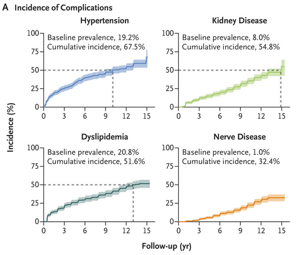

```{r setup, include=FALSE}
knitr::opts_chunk$set(echo = FALSE)
```

<style>
div.footnotes {
  position: absolute;
  bottom: 0;
  margin-bottom: 10px;
  width: 80%;
  font-size: 0.6em;
}
</style>

<script src="https://ajax.googleapis.com/ajax/libs/jquery/3.1.1/jquery.min.js"></script>
<script>
$(document).ready(function() {
  $('slide:not(.backdrop):not(.title-slide)').append('<div class=\"footnotes\">');

  $('footnote').each(function(index) {
    var text  = $(this).html();
    var fnNum = (index+1).toString();
    $(this).html(fnNum.sup());

    var footnote   = fnNum + '. ' + text + '<br/>';
    var oldContent = $(this).parents('slide').children('div.footnotes').html();
    var newContent = oldContent + footnote;
    $(this).parents('slide').children('div.footnotes').html(newContent);
  });
});
</script>

<script>
$(document).ready(function() {
  $('slide:not(.backdrop):not(.title-slide)').append('<div class=\"footnotes\">');

  $('footnote_nonum').each(function(index) {
    var text  = $(this).html();
    var fnNum = ("").toString();
    $(this).html(fnNum.sup());

    var footnote   = text + '<br/>';
    var oldContent = $(this).parents('slide').children('div.footnotes').html();
    var newContent = oldContent + footnote;
    $(this).parents('slide').children('div.footnotes').html(newContent);
  });
});
</script>


## Outline

- My career path
- Some interesting projects I've worked on
- Things I've learned
- Q&A

## Undergraduate and graduate studies in biology

- BA Biology and MS in Evolutionary and Population Biology, George Mason University
- Worked with scientists at the Nature Conservancy to study patterns of plant communities and invasive species in the forests along the Potomac River

<p align="center">
{height=40%, width=40%}
<p>

## Graduate studies in environmental science

- PhD program in Environmental Science at Duke University
- My research used diatoms to reconstruct the ecological history of Florida Bay

<p align="center">
{height=48%, width=48%} {height=48%, width=48%}
<p>


## My path to biostatistics

- While at Duke, I took graduate courses in statistics at North Carolina State University
- I was feeling less certain that I wanted to specialize in one particular research question, and statistics appealed to me as a tool to answer diverse questions
- I left my graduate program early with an MA and took a couple of years off
- Moved to the DC area and took a job as a Research Associate at the George Washington University Biostatistics Center

<p align="center">
{height=65%, width=65%}
<p>

## Working at a "coordinating center"

- Coordinating centers are established for multi-center clinical trials
- They are responsible for advising on study design and the analytic plan, all aspects of data management, performing the statistical analysis, manuscript writing, and general oversight and communications
- Statisticians work as part of large teams along with programmers, content matter experts, administrators, etc.
- These are generally large projects with 1-2 years of planning prior to study start and 3-4 years of data collection
- Analysis usually begins when sufficient baseline data are collected

## The TODAY study

- The TODAY study was a clinical trial to compare 3 treatments for type 2 diabetes in children and adolescents
- Type 2 diabetes (T2D) used to be known as adult-onset diabetes and results from a combination of genetic and lifestyle factors (overweight, inactivity)
- The incidence of T2D among youth is increasing.<footnote>https://www.cdc.gov/diabetes/research/reports/children-diabetes-rates-rise.html</footnote>

<p align="center">
{height=70%, width=70%} 
<p>

## T2D in youth

<footnote_nonum>Lawrence et al. 2021, JAMA.</footnote_nonum>

<p align="center">
{height=68%, width=68%} 
<p>

## T2D in youth

<footnote_nonum>TODAY Study Group 2021, NEJM.</footnote_nonum>

<p align="center">
{height=72%, width=72%} 
<p>

## The TODAY study results

<p align="center">
{height=75%, width=75%} 
<p>

## Things I learned at GWU

- Formulating a question/hypothesis that can be answered by a statistical test
- Designing data collection instruments 
- Writing code as part of a team
- Communicating statistical concepts to non-statisticians
- Writing articles for biomedical journals

## Graduate work at GWU and the University of Colorado

- While at GWU, I took graduate courses in math, programming, and statistics
- I was accepted into the PhD program in statistics at GWU and also by the PhD program in biostatistics at CU
- After visiting CU, I thought the faculty were more passionate about teaching, while still very active in research
- I also thought the curriculum at CU better integrated statistics and biology
- I continued working at GWU (remotely) while I was in graduate school at CU
- My dissertation was on methods for analyzing longitudinal outcomes in clinical trials prior to being completely observed 

## Job at the University of Colorado

- When I graduated with my PhD, I was offered a faculty position at GWU, but I would have to move back to DC
- I decided to look for a position that would allow me to stay in Colorado
- In 2013, I started working at CU as an Assistant Professor and Associate Director of the Child Health Biostatistics Core
- The mission of the CHBC is to collaborate with child health researchers on campus in all aspects of study design and statistical analysis
- I was appointed as Acting Director of the CHBC in 2018 and as Director in 2020 
- I work with many of the same investigators on the TODAY study

## Measuring changes in glucose rate of appearance in patients with diabetes

- In people with diabetes, hyperglycemia can result from inadequate insulin secretion and insulin resistance
- The degree of insulin resistance can be assessed by the gold-standard hyperinsulinemic euglycemic clamp 
- As insulin &#8593;, the liver and muscles stop producing glucose and adipose tissue stops releasing fatty acids
- The amount of insulin required to stop the production is a measure of insulin sensitivity

<p align="center">
{height=60%, width=60%} 
<p>

## Measuring changes in glucose rate of appearance in patients with diabetes

- The summary measure from the clamp is the amount of insulin required to suppress glucose production 50%
- In people with diabetes who are taking insulin, we can't measure this accurately

<p align="center">
{height=50%, width=50%} 
<p>

## Measuring changes in glucose rate of appearance in patients with diabetes

- We used mixed-effects models to examine changes in glucose Ra over time and compared this to the standard method
- We also used insulin as the independent variable to account for within participant variability in achieved insulin levels

<p align="center">
{height=45%, width=45%} 
<p>

<footnote_nonum>Pyle et al. 2016, AJP Endo Metab.</footnote_nonum>

## SMART designs

- Sequential Multiple Assignment Randomized Trials are used to design adaptive interventions individualized to patient needs
- The hallmark is that there are multiple intervention assignments within the same patient
- At each of K &#8805 1; decision points, a patient is randomized to the set of treatment options that are feasible given history of treatments and response
- Primary tailoring variable is used to determine whether changes are needed

## SMART designs

- Weight loss management study (Pfammatter et al. 2019, Contemp Clin Trials)

<p align="center">
{height=90%, width=90%} 
<p>

## SMART designs

- SMARTs utilize a factorial design in a sequential setting to efficiently test the main effects of the treatments
- Can also test how the interventions interact
- Statistical challenges 
    - Power calculations
    - Handling missing data and loss to follow up
    - Interim monitoring
    - Use of Q-learning algorithm to build an optimal sequence of interventions

## TODAY study proteomics and metabolomics

- With TODAY study investigators, I have a grant to identify protein and metabolite signatures of complications of youth-onset T2D using traditional statistical methods as well as machine learning methods
    - Linear models with moderated t-statistics
    - Sparse partial least-squares discriminant analysis (sPLS-DA)
    - Gene Set Enrichment Analysis
    - Boosted Cox regression
- We are also collaborating with an applied mathematician, Anita Layton, at the University of Waterloo to create deep learning models

## TODAY study proteomics and metabolomics

<p align="center">
{height=110%, width=110%} 
<p>

## Phenotypes of diabetic kidney disease

- Because of my collaborations with the TODAY study and other national study groups, I have access to rich longitudinal datasets related to diabetes and its complications
- This includes data from a longitudinal study of Pima Indian individuals that started in the 1960s
- We plan to harmonize the data from several of these studies, including proteomics and metabolomics, and then to use unsupervised cluster analysis to identify phenotypes of DKD
- Once clusters are identified, we can validate the phenotypes against kidney biopsy data in a subset of participants

## How is my CU job different from GWU?

- GWU
    - Large studies with large budgets and teams
    - Extremely careful data collection and cleaning
    - Long lead time for publications
    - Deep focus on 1 or 2 studies
- CU
    - Lots (!) of projects, sometimes un/underfunded
    - Smaller budgets, smaller teams, less time for data cleaning
    - Rapid time to publication
    - Smaller studies, but often participants are deeply phenotyped using gold-standard methods

## What do I do on a daily basis?

- Consultation and project meetings (Zoom!)
- Writing grants
- Writing code to do data cleaning and analysis
- Collaborating on manuscripts and abstracts
- Education (graduate students, medical students, residents, fellows, etc.)
- Reading about statistical methods and keeping up to date
- Managing other statisticians in the core
- Administrative tasks (budgets, talking to investigators about new projects, University and hospital committees, etc.)

## Things I've learned

- Keep learning new methods and skills, as well as subject matter content
- Sharpen your coding skills
- Writing and communication are important, no matter what area of statistics you work in
- Work with people you like 
- There are lots of different types of statistics jobs, even within academia

## Q&A